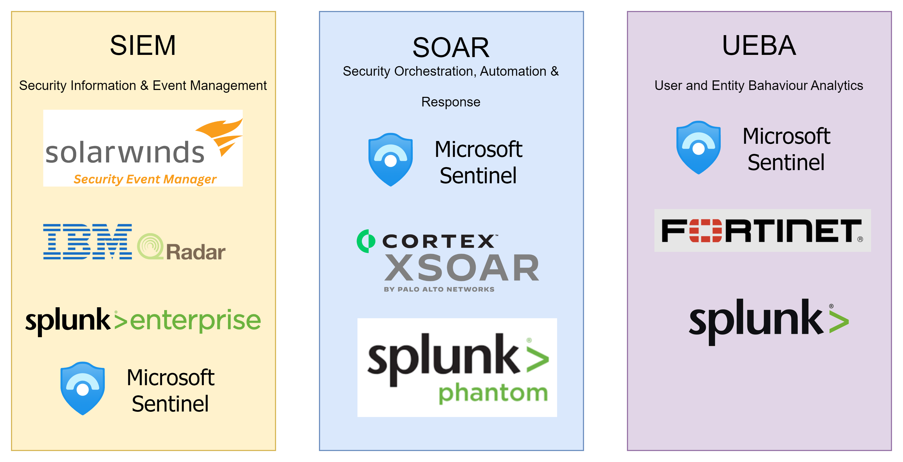

# Identify advanced threats with UEBA in Microsoft Sentinel

## What is **User** and **Entity** **Behavior** **Analytics** (UEBA)?

- As Microsoft Sentinel collects logs and alerts from all of its connected data sources, it analyzes them and builds baseline behavioral profiles of your organization's entities (such as users, hosts, IP addresses, and applications) across time and peer group horizon.
- Using a variety of techniques and machine learning capabilities, Microsoft Sentinel can then identify anomalous activity and help you determine if an asset has been compromised.

## Some use-cases of UEBA

### 01-Identify Malicious Users

- Any user tyring to upload a lot of data.
- Any user trying to send multiple emails than usual with big attachments.

### 02-Detect Threat Activities

- Any user exfiltrating data after leaving the organization (or after being fired).
- Any employee selling customer's data for financial gains.
- Any employee selling trade secrets/sales info outside organization.

### 03-Incident Prioritization

### 04-Entity Analytics

## `SIEM` vs `SOAR` vs `UEBA`

