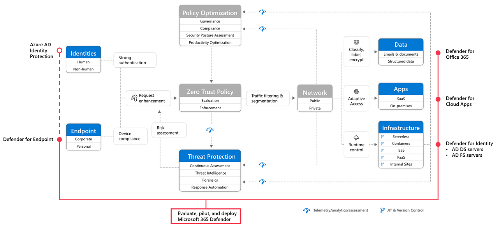

# Microsoft Defender XDR

## What is MS Defender XDR ?

- XDR stands for Extended Detection and Response.
- **Microsoft Defender XDR** is a unified pre and post-breach enterprise defense suite.
- **Microsoft Defender XDR** is an security solution that automatically collects, correlates, and analyzes signal, threat, and alert data from across your Microsoft 365 environment, including endpoint, email, applications, and identities.
- It helps security teams protect and detect their organizations by using information from other Microsoft security products, including:
  - **Microsoft Defender for Endpoint**
  - **Microsoft Defender for Office 365**
  - **Microsoft Defender for Identity**
  - **Microsoft Defender for Cloud Apps**
  - **Microsoft Defender Vulnerability Management**
  - **Microsoft Entra ID Protection**
  - **Microsoft Data Loss Prevention**

## How Microsoft Defender XDR protects ?

- Endpoints with Defender for Endpoint
- Assets with Defender Vulnerability Management
- Email and collaboration with Defender for Office 365
- Identities with Defender for Identity and Microsoft Entra ID Protection
- Applications with Microsoft Defender for Cloud Apps

## Zero Trust with Microsoft Defender XDR

- Microsoft Defender XDR helps you apply the principles of Zero Trust in the following ways:
  - **Verify explicitly**: Microsoft Defender XDR provides XDR across users, identities, devices, apps, and emails.
  - **Use least privileged access**:
    - If used with Microsoft Entra ID Protection, Microsoft Defender XDR blocks users based on the level of risk posed by an identity.
    - Microsoft Entra ID Protection is licensed separately from Microsoft Defender XDR and is included with Microsoft Entra ID P2.
  - **Assume breach**:
    - Microsoft Defender XDR continuously scans the environment for threats and vulnerabilities.
    - It can implement automated remediation tasks, including automated investigations and isolating endpoints.

## Setting-up the environment

- Create a new Microsoft 365 Subscription - 1 Month Free (https://www.microsoft.com/en-in/microsoft-365/microsoft-365-business-standard-one-month-trial?rtc=1)

- Create a new Microsoft Defender XDR Evaluation Account (https://learn.microsoft.com/en-us/microsoft-365/security/defender/eval-overview?view=o365-worldwide)

- [Activate Microsoft 365 E5 trial licenses to evaluate Microsoft Defender XDR](https://learn.microsoft.com/en-us/microsoft-365/security/defender/eval-create-eval-environment?view=o365-worldwide)

- [Enable and pilot Microsoft Defender for Office 365](https://learn.microsoft.com/en-us/microsoft-365/security/defender/eval-defender-office-365-overview?view=o365-worldwide)
