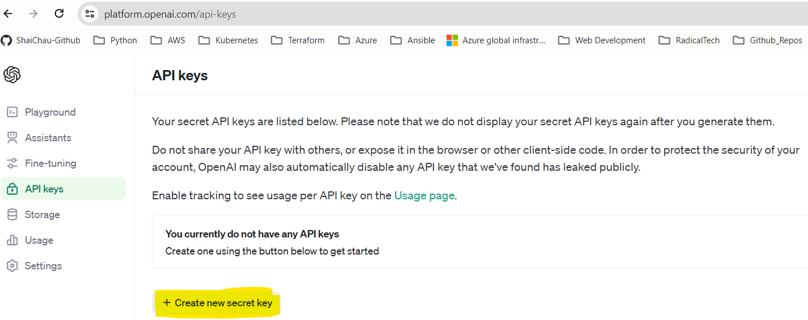

# Microsoft Sentinel with ChatGPT

##

### Step-01: Create an OpenAI Account

- Sign-up and navigate to this link: https://platform.openai.com/account/
- Navigate to API Keys section https://platform.openai.com/api-keys
  

### Step-02: Create a new Sentinel Playbook with ChatGPT integration

- **Microsoft Sentinel >> Automation >> Create >> Playbook with Incident trigger**

- Playbook Name: chat-gpt-playbook
- Subscription : <subscription_name>
- Resource Group: <rg_name>

### Step-03: Add a ChatGPT action in your Playbook

- Open the Playbook you created in previous step >> **New Step** >> Search **gpt** >> Select **GPT3 Completes your Prompt**

- Connection Name: ChatGPT
- API Key: <generated_in_step_one>
